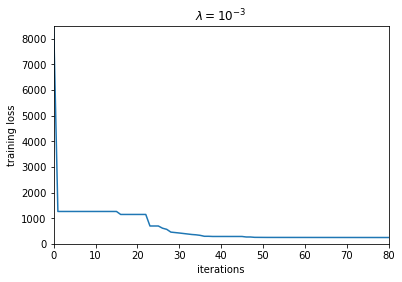
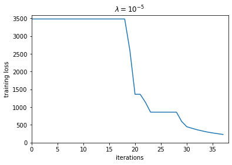
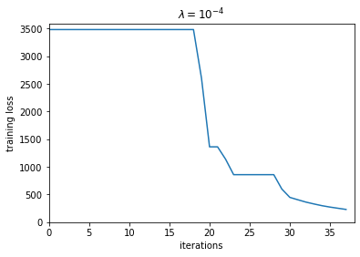
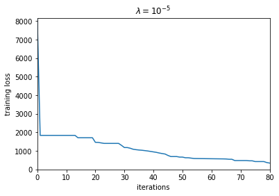
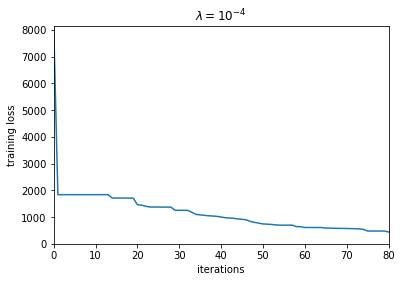
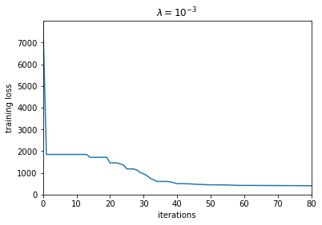
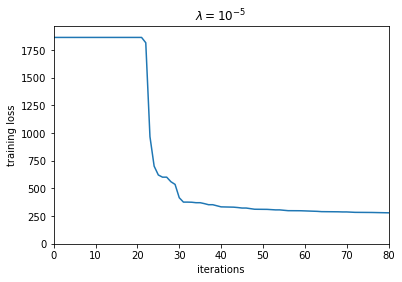

```python
import math
import numpy as np
import matplotlib.pyplot as plt
```

#### 3a)

$${\nabla}_\mathbf{w}f_\mathbf{w}(x) = \begin{bmatrix} \frac{\partial f_\mathbf{w}(x)}{\partial w_1} \\ \frac{\partial f_\mathbf{w}(x)}{\partial w_2} \\ \frac{\partial f_\mathbf{w}(x)}{\partial w_3} \\ \frac{\partial f_\mathbf{w}(x)}{\partial w_4} \\ \frac{\partial f_\mathbf{w}(x)}{\partial w_5} \\ \frac{\partial f_\mathbf{w}(x)}{\partial w_6} \\ \frac{\partial f_\mathbf{w}(x)}{\partial w_7} \\ \frac{\partial f_\mathbf{w}(x)}{\partial w_8} \\ \frac{\partial f_\mathbf{w}(x)}{\partial w_9} \\ \frac{\partial f_\mathbf{w}(x)}{\partial w_{10}} \\ \frac{\partial f_\mathbf{w}(x)}{\partial w_{11}} \\ \frac{\partial f_\mathbf{w}(x)}{\partial w_{12}} \\ \frac{\partial f_\mathbf{w}(x)}{\partial w_{13}} \\ \frac{\partial f_\mathbf{w}(x)}{\partial w_{14}} \\ \frac{\partial f_\mathbf{w}(x)}{\partial w_{15}} \\ \frac{\partial f_\mathbf{w}(x)}{\partial w_{16}} \end{bmatrix} = \begin{bmatrix} \phi (w_2x_1+w_3x_2+w_4x_3+w_5) \\ w_1x_1 \phi '(w_2x_1+w_3x_2+w_4x_3+w_5) \\ w_1x_2 \phi '(w_2x_1+w_3x_2+w_4x_3+w_5) \\ w_1x_3 \phi '(w_2x_1+w_3x_2+w_4x_3+w_5) \\ w_1 \phi '(w_2x_1+w_3x_2+w_4x_3+w_5) \\ \phi (w_7x_1+w_8x_2+w_9x_3+w_{10}) \\ w_6x_1 \phi '(w_7x_1+w_8x_2+w_9x_3+w_{10}) \\ w_6x_2 \phi '(w_7x_1+w_8x_2+w_9x_3+w_{10}) \\ w_6x_3 \phi '(w_7x_1+w_8x_2+w_9x_3+w_{10}) \\ w_6 \phi '(w_7x_1+w_8x_2+w_9x_3+w_{10}) \\ \phi (w_{12}x_1+w_{13}x_2+w_{14}x_3+w_{15}) \\ w_{11}x_1 \phi '(w_{12}x_1+w_{13}x_2+w_{14}x_3+w_{15}) \\ w_{11}x_2 \phi '(w_{12}x_1+w_{13}x_2+w_{14}x_3+w_{15}) \\ w_{11}x_3 \phi '(w_{12}x_1+w_{13}x_2+w_{14}x_3+w_{15}) \\ w_{11} \phi '(w_{12}x_1+w_{13}x_2+w_{14}x_3+w_{15}) \\ 1 \end{bmatrix}$$

#### 3b)
$$\mathbf{Dr}(\mathbf{w}) = \begin{bmatrix} \frac{\partial r_1(\mathbf{w})}{\partial w_1}&\frac{\partial r_1(\mathbf{w})}{\partial w_2}&\dots&\frac{\partial r_1(\mathbf{w})}{\partial w_{16}} \\ \frac{\partial r_2(\mathbf{w})}{\partial w_1}& \frac{\partial r_2(\mathbf{w})}{\partial w_2}&\dots&\frac{\partial r_2(\mathbf{w})}{\partial w_{16}} \\ \vdots&\vdots&&\vdots \\ \frac{\partial r_N(\mathbf{w})}{\partial w_1}&\frac{\partial r_N(\mathbf{w})}{\partial w_2}&\dots&\frac{\partial r_N(\mathbf{w})}{\partial w_{16}} \end{bmatrix} = \begin{bmatrix} \frac{\partial f_{\mathbf{w}}(x^{(1)})}{\partial w_1}&\frac{\partial f_{\mathbf{w}}(x^{(1)})}{\partial w_2}&\dots&\frac{\partial f_{\mathbf{w}}(x^{(1)})}{\partial w_{16}} \\ \frac{\partial f_{\mathbf{w}}(x^{(2)})}{\partial w_1}& \frac{\partial f_{\mathbf{w}}(x^{(2)})}{\partial w_2}&\dots&\frac{\partial f_{\mathbf{w}}(x^{(2)})}{\partial w_{16}} \\ \vdots&\vdots&&\vdots \\ \frac{\partial f_{\mathbf{w}}(x^{(N)})}{\partial w_1}&\frac{\partial f_{\mathbf{w}}(x^{(N)})}{\partial w_2}&\dots&\frac{\partial f_{\mathbf{w}}(x^{(N)})}{\partial w_{16}} \end{bmatrix} = \begin{bmatrix} {\nabla}_\mathbf{w}f_\mathbf{w}(x^{(1)})^T \\ {\nabla}_\mathbf{w}f_\mathbf{w}(x^{(2)})^T \\ \vdots \\ {\nabla}_\mathbf{w}f_\mathbf{w}(x^{(N)})^T \end{bmatrix}$$

#### 3c) (i)
I chose random points from a uniform distribution in $(-2, 2)$.


```python
def sigmoid(x):
    return (math.exp(x) - math.exp(-1 * x)) / (math.exp(x) + math.exp(-1 * x))
```


```python
# Calculating the derivative of the sigmoid function gives 1 - (sigmoid(x) ** 2)
def dsigmoid(x):
    return 1 - (sigmoid(x) ** 2)
```


```python
def gradient(x, w):
    return [sigmoid(w[1]*x[0] + w[2]*x[1] + w[3]*x[2] + w[4]), 
            w[0]*x[0]*dsigmoid(w[1]*x[0] + w[2]*x[1] + w[3]*x[2] + w[4]),
            w[0]*x[1]*dsigmoid(w[1]*x[0] + w[2]*x[1] + w[3]*x[2] + w[4]),
            w[0]*x[2]*dsigmoid(w[1]*x[0] + w[2]*x[1] + w[3]*x[2] + w[4]), 
            w[0]*dsigmoid(w[1]*x[0] + w[2]*x[1] + w[3]*x[2] + w[4]),
            sigmoid(w[6]*x[0] + w[7]*x[1] + w[8]*x[2] + w[9]), 
            w[5]*x[0]*dsigmoid(w[6]*x[0] + w[7]*x[1] + w[8]*x[2] + w[9]),
            w[5]*x[1]*dsigmoid(w[6]*x[0] + w[7]*x[1] + w[8]*x[2] + w[9]),
            w[5]*x[2]*dsigmoid(w[6]*x[0] + w[7]*x[1] + w[8]*x[2] + w[9]), 
            w[5]*dsigmoid(w[6]*x[0] + w[7]*x[1] + w[8]*x[2] + w[9]),
            sigmoid(w[11]*x[0] + w[12]*x[1] + w[13]*x[2] + w[14]), 
            w[10]*x[0]*dsigmoid(w[11]*x[0] + w[12]*x[1] + w[13]*x[2] + w[14]),
            w[10]*x[1]*dsigmoid(w[11]*x[0] + w[12]*x[1] + w[13]*x[2] + w[14]),
            w[10]*x[2]*dsigmoid(w[11]*x[0] + w[12]*x[1] + w[13]*x[2] + w[14]), 
            w[10]*dsigmoid(w[11]*x[0] + w[12]*x[1] + w[13]*x[2] + w[14]),
            1]
```


```python
def jacobian(data, w):
    return [gradient(x, w) for x in data]
```


```python
def fw(x, w):
    return w[0]*sigmoid(w[1]*x[0] + w[2]*x[1] + w[3]*x[2] + w[4]) + w[5]*sigmoid(w[6]*x[0] + w[7]*x[1] + w[8]*x[2] + w[9]) + w[10]*sigmoid(w[11]*x[0] + w[12]*x[1] + w[13]*x[2] + w[14]) + w[15]
```


```python
def g(x):
    return x[0] * x[1] + x[2]
```


```python
def r(x, w):
    return fw(x, w) - g(x)
```


```python
def loss(data, w, lamb):
    return sum([r(x, w) ** 2 for x in data]) + lamb * sum([wi ** 2 for wi in w])
```


```python
def rbold(data, w):
    return [r(x, w) for x in data]
```


```python
def A(data, w, lamb, lambk):
    a1 = np.array(jacobian(data, w))
    a2 = np.sqrt(lamb)*np.identity(16)
    a3 = np.sqrt(lambk)*np.identity(16)
    return np.concatenate((a1, a2, a3))
```


```python
def b(data, w, lamb, lambk):
    b1 = np.matmul(jacobian(data, w), w) - rbold(data, w)
    b2 = np.zeros(16)
    b3 = np.sqrt(lambk)*w
    return np.append(np.append(b1, b2), b3)
```


```python
def getNextW(data, w, lamb, lambk):
    w_next,_,_,_ = np.linalg.lstsq(A(data, w, lamb, lambk), b(data, w, lamb, lambk), rcond=None)
    return w_next
```

Using $\lambda = 10^{-5}$, we get $$\mathbf{w} = \begin{bmatrix} -1.81119611\\ 0.01672057\\ -0.05235694\\ -0.53380525\\ 0.08819614\\ 6.08380402\\ -0.33840415\\ -0.3398205\\ 0.02386589\\ 0.66556909\\ -5.85672418\\ -0.34713852\\ -0.32563561\\ -0.03099696\\ 0.62348097\\ 5.81161561 \end{bmatrix}$$


```python
X_train = 4 * np.random.rand(500, 3) - 2
initial_w = 2 * np.random.rand(16) - 1
```


```python
current_w = initial_w
initial_lamb = 0.00001
current_lambk = 0.00001
next_loss = 0
current_loss = float('inf') 
loss_per_it = []
```


```python
while current_loss > 243:
    next_w = getNextW(X_train, current_w, initial_lamb, current_lambk)
    next_loss = loss(X_train, next_w, initial_lamb)
    if (next_loss < current_loss):
        current_w = next_w
        current_lambk = 0.8 * current_lambk
        current_loss = next_loss
    else:
        current_lambk = 2 * current_lambk
    loss_per_it.append(current_loss)
```


```python
current_w
```


    array([-1.81119611,  0.01672057, -0.05235694, -0.53380525,  0.08819614,
            6.08380402, -0.33840415, -0.3398205 ,  0.02386589, -0.66556909,
           -5.85672418, -0.34713852, -0.32563561, -0.03099696,  0.62348097,
            5.81161561])


```python
ws = [current_w]
```


```python
plt.plot(loss_per_it)
plt.ylabel('training loss')
plt.xlabel('iterations')
plt.title(r'$\lambda = 10^{-5}$')
plt.axis([0, 80, 0, max(loss_per_it)])
plt.show()
```


    

    


```python
it5 = loss_per_it
```

Using $\lambda = 10^{-4}$, we get $$\mathbf{w} = \begin{bmatrix} -1.89363266\\  0.01937842\\ -0.05593445\\ -0.52059953\\  0.0881665\\
        6.41905446\\ -0.32083145\\ -0.32305973\\  0.02010413\\ -0.62731592\\
       -5.94186692\\ -0.35546263\\ -0.3318386\\ -0.02679276\\  0.61945969\\
        5.87857936 \end{bmatrix}$$


```python
current_w = initial_w
initial_lamb = 0.0001
current_lambk = 0.00001
next_loss = 0
current_loss = float('inf') 
loss_per_it = []
```


```python
while current_loss > 243:
    next_w = getNextW(X_train, current_w, initial_lamb, current_lambk)
    next_loss = loss(X_train, next_w, initial_lamb)
    if (next_loss < current_loss):
        current_w = next_w
        current_lambk = 0.8 * current_lambk
        current_loss = next_loss
    else:
        current_lambk = 2 * current_lambk
    loss_per_it.append(current_loss)
```


```python
current_w
```


    array([-1.89363266,  0.01937842, -0.05593445, -0.52059953,  0.0881665 ,
            6.41905446, -0.32083145, -0.32305973,  0.02010413, -0.62731592,
           -5.94186692, -0.35546263, -0.3318386 , -0.02679276,  0.61945969,
            5.87857936])


```python
ws.append(current_w)
```


```python
plt.plot(loss_per_it)
plt.ylabel('training loss')
plt.xlabel('iterations')
plt.title(r'$\lambda = 10^{-4}$')
plt.axis([0, 80, 0, max(loss_per_it)])
plt.show()
```


    

    


```python
it4 = loss_per_it
```

Using $\lambda = 10^{-3}$, we get $$\mathbf{w} = \begin{bmatrix} -2.10447442\\ -0.00713297\\ -0.04053203\\ -0.49282216\\  0.08563284\\
        4.20659151\\ -0.42271472\\ -0.42700515\\  0.02640867\\ -0.85637419\\
       -3.77564997\\ -0.45521592\\ -0.43647924\\ -0.03499611\\  0.82159764\\
        4.50110251 \end{bmatrix}$$


```python
current_w = initial_w
initial_lamb = 0.001
current_lambk = 0.00001
next_loss = 0
current_loss = float('inf') 
loss_per_it = []
```


```python
while current_loss > 243:
    next_w = getNextW(X_train, current_w, initial_lamb, current_lambk)
    next_loss = loss(X_train, next_w, initial_lamb)
    if (next_loss < current_loss):
        current_w = next_w
        current_lambk = 0.8 * current_lambk
        current_loss = next_loss
    else:
        current_lambk = 2 * current_lambk
    loss_per_it.append(current_loss)
```


```python
current_w
```


    array([-2.10447442, -0.00713297, -0.04053203, -0.49282216,  0.08563284,
            4.20659151, -0.42271472, -0.42700515,  0.02640867, -0.85637419,
           -3.77564997, -0.45521592, -0.43647924, -0.03499611,  0.82159764,
            4.50110251])


```python
ws.append(current_w)
```


```python
plt.plot(loss_per_it)
plt.ylabel('training loss')
plt.xlabel('iterations')
plt.title(r'$\lambda = 10^{-3}$')
plt.axis([0, 80, 0, max(loss_per_it)])
plt.show()
```


    

    


```python
it3 = loss_per_it
```


```python
print(len(it5), len(it4), len(it3))
```

    821 2988 242
    

Even though we get similar training loss graphs for different values of $\lambda$, the resulting $\mathbf{w}$'s were different. They also converged at different rates.

Testing using a different initial $\mathbf{w}$:


```python
initial_w = 2 * np.random.rand(16) - 1
```

Using $\lambda = 10^{-5}$, we get $$\mathbf{w} = \begin{bmatrix} -4.30221124\\ -0.73494952\\ -0.61947623\\ -0.05564597\\  1.13357467\\
        5.85512242\\ -0.17019611\\ -0.22347251\\  0.1793794\\ -0.1386147\\
       -0.6795051\\  5.04486389\\ -0.67415456\\  0.37759932\\ -3.26873492\\
        2.92415638 \end{bmatrix}$$


```python
current_w = initial_w
initial_lamb = 0.00001
current_lambk = 0.00001
next_loss = 0
current_loss = float('inf') 
loss_per_it = []
```


```python
while current_loss > 243:
    next_w = getNextW(X_train, current_w, initial_lamb, current_lambk)
    next_loss = loss(X_train, next_w, initial_lamb)
    if (next_loss < current_loss):
        current_w = next_w
        current_lambk = 0.8 * current_lambk
        current_loss = next_loss
    else:
        current_lambk = 2 * current_lambk
    loss_per_it.append(current_loss)
```


```python
current_w
```


    array([-4.30221124, -0.73494952, -0.61947623, -0.05564597,  1.13357467,
            5.85512242, -0.17019611, -0.22347251,  0.1793794 , -0.1386147 ,
           -0.6795051 ,  5.04486389, -0.67415456,  0.37759932, -3.26873492,
            2.92415638])


```python
ws.append(current_w)
```


```python
plt.plot(loss_per_it)
plt.ylabel('training loss')
plt.xlabel('iterations')
plt.title(r'$\lambda = 10^{-5}$')
plt.axis([0, len(loss_per_it), 0, max(loss_per_it) + 100])
plt.show()
```


    

    


```python
it5 = loss_per_it
```

Using $\lambda = 10^{-4}$, we get $$\mathbf{w} = \begin{bmatrix} -4.30222096\\ -0.73499779\\ -0.61952559\\ -0.05558174\\  1.13366574\\
        5.85550713\\ -0.17014993\\ -0.2234508\\ 0.17937842\\ -0.13838766\\
       -0.67968638\\  5.04304976\\ -0.67408738\\  0.37742614\\ -3.26789607\\
        2.9230314 \end{bmatrix}$$


```python
current_w = initial_w
initial_lamb = 0.0001
current_lambk = 0.00001
next_loss = 0
current_loss = float('inf') 
loss_per_it = []
```


```python
while current_loss > 243:
    next_w = getNextW(X_train, current_w, initial_lamb, current_lambk)
    next_loss = loss(X_train, next_w, initial_lamb)
    if (next_loss < current_loss):
        current_w = next_w
        current_lambk = 0.8 * current_lambk
        current_loss = next_loss
    else:
        current_lambk = 2 * current_lambk
    loss_per_it.append(current_loss)
```


```python
current_w
```


    array([-4.30222096, -0.73499779, -0.61952559, -0.05558174,  1.13366574,
            5.85550713, -0.17014993, -0.2234508 ,  0.17937842, -0.13838766,
           -0.67968638,  5.04304976, -0.67408738,  0.37742614, -3.26789607,
            2.9230314 ])


```python
ws.append(current_w)
```


```python
plt.plot(loss_per_it)
plt.ylabel('training loss')
plt.xlabel('iterations')
plt.title(r'$\lambda = 10^{-4}$')
plt.axis([0, len(loss_per_it), 0, max(loss_per_it) + 100])
plt.show()
```


    

    


```python
it4 = loss_per_it
```

Using $\lambda = 10^{-3}$, we get $$\mathbf{w} = \begin{bmatrix} -4.30235812\\ -0.73547221\\ -0.61996879\\ -0.05499167\\  1.1344861\\
        5.85935465\\ -0.1697259\\ -0.22323619\\  0.17936213\\ -0.13628603\\
       -0.68137366\\  5.02546829\\ -0.67294849\\  0.37596614\\ -3.25946235\\
        2.91262187 \end{bmatrix}$$


```python
current_w = initial_w
initial_lamb = 0.001
current_lambk = 0.00001
next_loss = 0
current_loss = float('inf') 
loss_per_it = []
```


```python
while current_loss > 243:
    next_w = getNextW(X_train, current_w, initial_lamb, current_lambk)
    next_loss = loss(X_train, next_w, initial_lamb)
    if (next_loss < current_loss):
        current_w = next_w
        current_lambk = 0.8 * current_lambk
        current_loss = next_loss
    else:
        current_lambk = 2 * current_lambk
    loss_per_it.append(current_loss)
```


```python
current_w
```


    array([-4.30235812, -0.73547221, -0.61996879, -0.05499167,  1.1344861 ,
            5.85935465, -0.1697259 , -0.22323619,  0.17936213, -0.13628603,
           -0.68137366,  5.02546829, -0.67294849,  0.37596614, -3.25946235,
            2.91262187])


```python
ws.append(current_w)
```


```python
plt.plot(loss_per_it)
plt.ylabel('training loss')
plt.xlabel('iterations')
plt.title(r'$\lambda = 10^{-3}$')
plt.axis([0, len(loss_per_it), 0, max(loss_per_it) + 100])
plt.show()
```


    

    


```python
it3 = loss_per_it
```


```python
print(len(it5), len(it4), len(it3))
```

    38 38 38
    

Interestingly, with this initial starting $\mathbf{w}$, the final values of $\mathbf{w}$ ended up being similar. They would likely start to diverge from each other more if the threshold for stopping was changed (but it was not for consistency).

#### 3c) (ii)
Define the mean squared error to be
$$ \frac{1}{N} \sum_{n=1}^{N} (f_{\mathbf{w}}(x^{(N)}) - y^{(n)})^2 $$

### First initial w
<table style="width:80%">
    <tr>
        <th>
        <th>$\lambda = 10^{-5}$</th>
        <th>$\lambda = 10^{-4}$</th>
        <th>$\lambda = 10^{-3}$</th> 
    </tr>
    <tr>
        <td>iterations to converge</td>
        <td>821</td>
        <td>2988</td>
        <td>242</td>
      </tr>
      <tr>
        <td>training MSE</td>
        <td>0.48595</td>
        <td>0.48597</td>
        <td>0.48588</td>
      </tr>
      <tr>
        <td>testing MSE, N = 50</td>
        <td>0.38600</td>
        <td>0.38644</td>
        <td>0.38466</td>
      </tr>
      <tr>
        <td>testing MSE, N = 150</td>
        <td>0.59064</td>
        <td>0.59033</td>
        <td>0.59764</td>
      </tr>
      <tr>
        <td>testing MSE, N = 250</td>
        <td>0.55723</td>
        <td>0.55676</td>
        <td>0.55885</td>
      </tr>
</table>

The MSE seems to depend more on the actual set of numbers than lambda. All values of lambda produced a similar MSE for each test set. Having a similar MSE for each test set is expected though, since they trained on the same training set.


```python
X_test_50 = 4 * np.random.rand(50, 3) - 2
X_test_150 = 4 * np.random.rand(150, 3) - 2
X_test_250 = 4 * np.random.rand(250, 3) - 2
```


```python
sum([r ** 2 for r in rbold(X_train, ws[0])]) / len(X_train)
```


    0.48595085283672873


```python
sum([r ** 2 for r in rbold(X_train, ws[1])]) / len(X_train)
```


    0.48597180200078954


```python
sum([r ** 2 for r in rbold(X_train, ws[2])]) / len(X_train)
```


    0.4858757559429372


```python
sum([r ** 2 for r in rbold(X_test_50, ws[0])]) / len(X_test_50)
```


    0.38598757255699306


```python
sum([r ** 2 for r in rbold(X_test_50, ws[1])]) / len(X_test_50)
```


    0.386443268978512


```python
sum([r ** 2 for r in rbold(X_test_50, ws[2])]) / len(X_test_50)
```


    0.38465739657473463


```python
sum([r ** 2 for r in rbold(X_test_150, ws[0])]) / len(X_test_150)
```


    0.5906428947232691


```python
sum([r ** 2 for r in rbold(X_test_150, ws[1])]) / len(X_test_150)
```


    0.5903295507295581


```python
sum([r ** 2 for r in rbold(X_test_150, ws[2])]) / len(X_test_150)
```


    0.5976374796799354


```python
sum([r ** 2 for r in rbold(X_test_250, ws[0])]) / len(X_test_250)
```


    0.5572260041304872


```python
sum([r ** 2 for r in rbold(X_test_250, ws[1])]) / len(X_test_250)
```


    0.5567634325968317


```python
sum([r ** 2 for r in rbold(X_test_250, ws[2])]) / len(X_test_250)
```


    0.558846732419592


### Second initial w
<table style="width:80%">
    <tr>
        <th>
        <th>$\lambda = 10^{-5}$</th>
        <th>$\lambda = 10^{-4}$</th>
        <th>$\lambda = 10^{-3}$</th> 
    </tr>
    <tr>
        <td>iterations to converge</td>
        <td>38</td>
        <td>38</td>
        <td>38</td>
      </tr>
      <tr>
        <td>training MSE</td>
        <td>0.46091</td>
        <td>0.46090</td>
        <td>0.46083</td>
      </tr>
      <tr>
        <td>testing MSE, N = 50</td>
        <td>0.37958</td>
        <td>0.37955</td>
        <td>0.37930</td>
      </tr>
      <tr>
        <td>testing MSE, N = 150</td>
        <td>0.53335</td>
        <td>0.53335</td>
        <td>0.53332</td>
      </tr>
      <tr>
        <td>testing MSE, N = 250</td>
        <td>0.56304</td>
        <td>0.56302</td>
        <td>0.56293</td>
      </tr>
</table>

Again, the MSE seems to depend more on the actual set of numbers than lambda. In this case though, it seems that the larger value of lambda resulted in a slightly smaller MSE across all test sets and the training set.


```python
sum([r ** 2 for r in rbold(X_train, ws[3])]) / len(X_train)
```


    0.46091102248528765


```python
sum([r ** 2 for r in rbold(X_train, ws[4])]) / len(X_train)
```


    0.4609022114197272


```python
sum([r ** 2 for r in rbold(X_train, ws[5])]) / len(X_train)
```


    0.4608260301377086


```python
sum([r ** 2 for r in rbold(X_test_50, ws[3])]) / len(X_test_50)
```


    0.3795846816861358


```python
sum([r ** 2 for r in rbold(X_test_50, ws[4])]) / len(X_test_50)
```


    0.3795548226356842


```python
sum([r ** 2 for r in rbold(X_test_50, ws[5])]) / len(X_test_50)
```


    0.3793023776193472


```python
sum([r ** 2 for r in rbold(X_test_150, ws[3])]) / len(X_test_150)
```


    0.5333538448330938


```python
sum([r ** 2 for r in rbold(X_test_150, ws[4])]) / len(X_test_150)
```


    0.5333522015377999


```python
sum([r ** 2 for r in rbold(X_test_150, ws[5])]) / len(X_test_150)
```


    0.5333246537317127


```python
sum([r ** 2 for r in rbold(X_test_250, ws[3])]) / len(X_test_250)
```


    0.5630355359955657


```python
sum([r ** 2 for r in rbold(X_test_250, ws[4])]) / len(X_test_250)
```


    0.5630238720224313


```python
sum([r ** 2 for r in rbold(X_test_250, ws[5])]) / len(X_test_250)
```


    0.5629267412768284


#### 3c) (iii)
I will reuse code from the first part by redefining g. Everything else will remain the same, and it can be easily reused since most of the code was defined in functions. Let $g(\mathbf{x}) = x_1(x_2x_3 + 1)$.


```python
def g(x):
    return x[0] * x[1] * x[2] + x[0]
```

Using $\lambda = 10^{-5}$, we get $$\mathbf{w} = \begin{bmatrix} -11.4404042\\-0.189175582\\  0.287375079\\ 0.430279584\\
        0.0272918005\\  5.55112985\\ -0.538192813\\ -0.328367064\\
       -0.380108476\\  0.0332941323\\  10.6450964\\  0.185915768\\
        0.442882756\\ -0.310089557\\  0.00991955507\\  0.0212092302 \end{bmatrix}$$


```python
initial_w = 2 * np.random.rand(16) - 1
```


```python
current_w = initial_w
initial_lamb = 0.00001
current_lambk = 0.00001
next_loss = 0
current_loss = float('inf') 
loss_per_it = []
```


```python
while current_loss > 260:
    next_w = getNextW(X_train, current_w, initial_lamb, current_lambk)
    next_loss = loss(X_train, next_w, initial_lamb)
    if (next_loss < current_loss):
        current_w = next_w
        current_lambk = 0.8 * current_lambk
        current_loss = next_loss
    else:
        current_lambk = 2 * current_lambk
    loss_per_it.append(current_loss)
```


```python
current_w
```


    array([-1.14404042e+01, -1.89175582e-01,  2.87375079e-01, -4.30279584e-01,
            2.72918005e-02,  5.55112985e+00, -5.38192813e-01, -3.28367064e-01,
           -3.80108476e-01,  3.32941323e-02,  1.06450964e+01,  1.85915768e-01,
            4.42882756e-01, -3.10089557e-01,  9.91955507e-03,  2.12092302e-02])


```python
ws = [current_w]
```


```python
plt.plot(loss_per_it)
plt.ylabel('training loss')
plt.xlabel('iterations')
plt.title(r'$\lambda = 10^{-5}$')
plt.axis([0, 80, 0, max(loss_per_it)])
plt.show()
```


    

    


```python
it5 = loss_per_it
```

Using $\lambda = 10^{-4}$, we get $$\mathbf{w} = \begin{bmatrix} -11.4998195\\ -0.188151876\\  0.287655598\\ -0.429631226\\
        0.0272500120\\  5.55665684\\ -0.537550290\\ -0.328083349\\
       -0.379607898\\  0.0332982675\\  10.7051313\\  0.184821159\\
        0.442331275\\ -0.310083187\\  0.00999130595\\  0.0208810392 \end{bmatrix}$$


```python
current_w = initial_w
initial_lamb = 0.0001
current_lambk = 0.00001
next_loss = 0
current_loss = float('inf') 
loss_per_it = []
```


```python
while current_loss > 260:
    next_w = getNextW(X_train, current_w, initial_lamb, current_lambk)
    next_loss = loss(X_train, next_w, initial_lamb)
    if (next_loss < current_loss):
        current_w = next_w
        current_lambk = 0.8 * current_lambk
        current_loss = next_loss
    else:
        current_lambk = 2 * current_lambk
    loss_per_it.append(current_loss)
```


```python
current_w
```


    array([-1.14998195e+01, -1.88151876e-01,  2.87655598e-01, -4.29631226e-01,
            2.72500120e-02,  5.55665684e+00, -5.37550290e-01, -3.28083349e-01,
           -3.79607898e-01,  3.32982675e-02,  1.07051313e+01,  1.84821159e-01,
            4.42331275e-01, -3.10083187e-01,  9.99130595e-03,  2.08810392e-02])


```python
ws.append(current_w)
```


```python
plt.plot(loss_per_it)
plt.ylabel('training loss')
plt.xlabel('iterations')
plt.title(r'$\lambda = 10^{-4}$')
plt.axis([0, 80, 0, max(loss_per_it)])
plt.show()
```


    

    


```python
it4 = loss_per_it
```

Using $\lambda = 10^{-3}$, we get $$\mathbf{w} = \begin{bmatrix} 4.90389477\\ -0.55544577\\ -0.3618162\\ -0.39208929\\  0.03514988\\
       11.87338875\\  0.16640926\\ -0.32008879\\  0.42476737\\ -0.02842737\\
       11.22268267\\  0.16981757\\  0.46280171\\ -0.32556998\\  0.01331923\\
        0.01415385 \end{bmatrix}$$


```python
current_w = initial_w
initial_lamb = 0.001
current_lambk = 0.00001
next_loss = 0
current_loss = float('inf') 
loss_per_it = []
```


```python
while current_loss > 260:
    next_w = getNextW(X_train, current_w, initial_lamb, current_lambk)
    next_loss = loss(X_train, next_w, initial_lamb)
    if (next_loss < current_loss):
        current_w = next_w
        current_lambk = 0.8 * current_lambk
        current_loss = next_loss
    else:
        current_lambk = 2 * current_lambk
    loss_per_it.append(current_loss)
```


```python
current_w
```


    array([ 4.90389477, -0.55544577, -0.3618162 , -0.39208929,  0.03514988,
           11.87338875,  0.16640926, -0.32008879,  0.42476737, -0.02842737,
           11.22268267,  0.16981757,  0.46280171, -0.32556998,  0.01331923,
            0.01415385])


```python
ws.append(current_w)
```


```python
plt.plot(loss_per_it)
plt.ylabel('training loss')
plt.xlabel('iterations')
plt.title(r'$\lambda = 10^{-3}$')
plt.axis([0, 80, 0, max(loss_per_it)])
plt.show()
```


    

    


```python
it3 = loss_per_it
```


```python
print(len(it5), len(it4), len(it3))
```

    631 364 1383
    

For $\lambda = 10^{-3}$, the values of $\mathbf{w}$ were much more regularized, and also very different from when $\lambda = 10^{-4}$ and $\lambda = 10^{-5}$ were used.

Testing using a different initial  𝐰 :

Using $\lambda = 10^{-5}$, we get $$\mathbf{w} = \begin{bmatrix} -10.6490076\\ -0.185736247\\ -0.448318193\\  0.308336863\\
       -0.0102702130\\  11.4443527\\  0.188177225\\ -0.290196633\\
        0.426323379\\ -0.0276104336\\ -5.54683651\\  0.535198975\\
        0.330934917\\  0.377110756\\ -0.0329889833\\  0.0213624261 \end{bmatrix}$$


```python
initial_w = 2 * np.random.rand(16) - 1
```


```python
current_w = initial_w
initial_lamb = 0.00001
current_lambk = 0.00001
next_loss = 0
current_loss = loss(X_train, initial_w, initial_lamb)
loss_per_it = []
```


```python
while current_loss > 260:
    next_w = getNextW(X_train, current_w, initial_lamb, current_lambk)
    next_loss = loss(X_train, next_w, initial_lamb)
    if (next_loss < current_loss):
        current_w = next_w
        current_lambk = 0.8 * current_lambk
        current_loss = next_loss
    else:
        current_lambk = 2 * current_lambk
    loss_per_it.append(current_loss)
```


```python
current_w
```


    array([-1.06490076e+01, -1.85736247e-01, -4.48318193e-01,  3.08336863e-01,
           -1.02702130e-02,  1.14443527e+01,  1.88177225e-01, -2.90196633e-01,
            4.26323379e-01, -2.76104336e-02, -5.54683651e+00,  5.35198975e-01,
            3.30934917e-01,  3.77110756e-01, -3.29889833e-02,  2.13624261e-02])


```python
ws.append(current_w)
```


```python
plt.plot(loss_per_it)
plt.ylabel('training loss')
plt.xlabel('iterations')
plt.title(r'$\lambda = 10^{-5}$')
plt.axis([0, 80, 0, max(loss_per_it) + 100])
plt.show()
```


    

    


```python
it5 = loss_per_it
```

Using $\lambda = 10^{-4}$, we get $$\mathbf{w} = \begin{bmatrix} -10.7031049\\ -0.184814984\\ -0.447385102\\  -0.308213436\\
       -0.0102966605\\  11.5008763\\  0.187454221\\ -0.290010140\\
        0.425851327\\ -0.0275499383\\ -5.56077751\\  0.534428061\\
        0.330166347\\  0.376595296\\ -0.0329825370\\ 0.0211166000 \end{bmatrix}$$


```python
current_w = initial_w
initial_lamb = 0.0001
current_lambk = 0.00001
next_loss = 0
current_loss = loss(X_train, initial_w, initial_lamb)
loss_per_it = []
```


```python
while current_loss > 260:
    next_w = getNextW(X_train, current_w, initial_lamb, current_lambk)
    next_loss = loss(X_train, next_w, initial_lamb)
    if (next_loss < current_loss):
        current_w = next_w
        current_lambk = 0.8 * current_lambk
        current_loss = next_loss
    else:
        current_lambk = 2 * current_lambk
    loss_per_it.append(current_loss)
```


```python
current_w
```


    array([-1.07031049e+01, -1.84814984e-01, -4.47385102e-01,  3.08213436e-01,
           -1.02966605e-02,  1.15008763e+01,  1.87454221e-01, -2.90010140e-01,
            4.25851327e-01, -2.75499383e-02, -5.56077751e+00,  5.34428061e-01,
            3.30166347e-01,  3.76595296e-01, -3.29825370e-02,  2.11166000e-02])


```python
ws.append(current_w)
```


```python
plt.plot(loss_per_it)
plt.ylabel('training loss')
plt.xlabel('iterations')
plt.title(r'$\lambda = 10^{-4}$')
plt.axis([0, 80, 0, max(loss_per_it) + 100])
plt.show()
```


    

    


```python
it4 = loss_per_it
```

Using $\lambda = 10^{-3}$, we get $$\mathbf{w} = \begin{bmatrix} -1.89363266\\  0.01937842\\ -0.05593445\\ -0.52059953\\  0.0881665\\
        6.41905446\\ -0.32083145\\ -0.32305973\\  0.02010413\\ -0.62731592\\
       -5.94186692\\ -0.35546263\\ -0.3318386\\ -0.02679276\\  0.61945969\\
        5.87857936 \end{bmatrix}$$


```python
current_w = initial_w
initial_lamb = 0.001
current_lambk = 0.00001
next_loss = 0
current_loss = loss(X_train, initial_w, initial_lamb) 
loss_per_it = []
```


```python
while current_loss > 260:
    next_w = getNextW(X_train, current_w, initial_lamb, current_lambk)
    next_loss = loss(X_train, next_w, initial_lamb)
    if (next_loss < current_loss):
        current_w = next_w
        current_lambk = 0.8 * current_lambk
        current_loss = next_loss
    else:
        current_lambk = 2 * current_lambk
    loss_per_it.append(current_loss)
```


```python
current_w
```


    array([-1.12958701e+01, -1.75087410e-01, -4.38776111e-01,  3.07448036e-01,
           -1.06660272e-02,  1.21101025e+01,  1.79423934e-01, -2.89326509e-01,
            4.20836925e-01, -2.69764602e-02, -5.68035512e+00,  5.27222080e-01,
            3.23618593e-01,  3.71617559e-01, -3.29674004e-02,  1.82951943e-02])


```python
ws.append(current_w)
```


```python
plt.plot(loss_per_it)
plt.ylabel('training loss')
plt.xlabel('iterations')
plt.title(r'$\lambda = 10^{-3}$')
plt.axis([0, 80, 0, max(loss_per_it) + 100])
plt.show()
```


    

    


```python
it3 = loss_per_it
```


```python
print(len(it5), len(it4), len(it3))
```

    750 779 1273
    

Using this intiial $\mathbf{w}$, the values of $w_1, w_6, w_{11}$ had the greatest magnitude, similar to the first initial $\mathbf{w}$. The values of the final $\mathbf{w}$ were similar across all the values of $\lambda$ used.

### First initial w
<table style="width:80%">
    <tr>
        <th>
        <th>$\lambda = 10^{-5}$</th>
        <th>$\lambda = 10^{-4}$</th>
        <th>$\lambda = 10^{-3}$</th> 
    </tr>
    <tr>
        <td>iterations to converge</td>
        <td>631</td>
        <td>364</td>
        <td>1383</td>
      </tr>
      <tr>
        <td>training MSE</td>
        <td>0.51999</td>
        <td>0.51994</td>
        <td>0.52134</td>
      </tr>
      <tr>
        <td>testing MSE, N = 50</td>
        <td>0.55312</td>
        <td>0.55326</td>
        <td>0.54245</td>
      </tr>
      <tr>
        <td>testing MSE, N = 150</td>
        <td>0.45852</td>
        <td>0.45865</td>
        <td>0.47650</td>
      </tr>
      <tr>
        <td>testing MSE, N = 250</td>
        <td>0.56956</td>
        <td>0.56953</td>
        <td>0.57610</td>
      </tr>
</table>

Again, it seems like the MSE is more dependent on the actual set of numbers rather than the regularization constant used.


```python
sum([r ** 2 for r in rbold(X_train, ws[0])]) / len(X_train)
```


    0.5199898009946167


```python
sum([r ** 2 for r in rbold(X_train, ws[1])]) / len(X_train)
```


    0.5199434149102712


```python
sum([r ** 2 for r in rbold(X_train, ws[2])]) / len(X_train)
```


    0.5213384627307802


```python
sum([r ** 2 for r in rbold(X_test_50, ws[0])]) / len(X_test_50)
```


    0.5531249093906844


```python
sum([r ** 2 for r in rbold(X_test_50, ws[1])]) / len(X_test_50)
```


    0.553262628781212


```python
sum([r ** 2 for r in rbold(X_test_50, ws[2])]) / len(X_test_50)
```


    0.5424505891214344


```python
sum([r ** 2 for r in rbold(X_test_150, ws[0])]) / len(X_test_150)
```


    0.45852433689558597


```python
sum([r ** 2 for r in rbold(X_test_150, ws[1])]) / len(X_test_150)
```


    0.4586495423105072


```python
sum([r ** 2 for r in rbold(X_test_150, ws[2])]) / len(X_test_150)
```


    0.476502398616936


```python
sum([r ** 2 for r in rbold(X_test_250, ws[0])]) / len(X_test_250)
```


    0.5695627495130325


```python
sum([r ** 2 for r in rbold(X_test_250, ws[1])]) / len(X_test_250)
```


    0.5695340164180385


```python
sum([r ** 2 for r in rbold(X_test_250, ws[2])]) / len(X_test_250)
```


    0.5761023595121697


### Second initial w
<table style="width:80%">
    <tr>
        <th>
        <th>$\lambda = 10^{-5}$</th>
        <th>$\lambda = 10^{-4}$</th>
        <th>$\lambda = 10^{-3}$</th> 
    </tr>
    <tr>
        <td>iterations to converge</td>
        <td>750</td>
        <td>779</td>
        <td>1273</td>
      </tr>
      <tr>
        <td>training MSE</td>
        <td>0.51999</td>
        <td>0.51994</td>
        <td>0.51958</td>
      </tr>
      <tr>
        <td>testing MSE, N = 50</td>
        <td>0.55097</td>
        <td>0.55129</td>
        <td>0.55421</td>
      </tr>
      <tr>
        <td>testing MSE, N = 150</td>
        <td>0.46310</td>
        <td>0.46291</td>
        <td>0.46173</td>
      </tr>
      <tr>
        <td>testing MSE, N = 250</td>
        <td>0.57126</td>
        <td>0.57116</td>
        <td>0.57034</td>
      </tr>
</table>

In this case, we can see that using a larger regularization constant allowed the neural network to generalize better on new data than using a smaller regularization constant.


```python
sum([r ** 2 for r in rbold(X_train, ws[3])]) / len(X_train)
```


    0.5199897158762834


```python
sum([r ** 2 for r in rbold(X_train, ws[4])]) / len(X_train)
```


    0.5199423122032277


```python
sum([r ** 2 for r in rbold(X_train, ws[5])]) / len(X_train)
```


    0.5195846708876606


```python
sum([r ** 2 for r in rbold(X_test_50, ws[3])]) / len(X_test_50)
```


    0.5509694828074639


```python
sum([r ** 2 for r in rbold(X_test_50, ws[4])]) / len(X_test_50)
```


    0.5512927323053236


```python
sum([r ** 2 for r in rbold(X_test_50, ws[5])]) / len(X_test_50)
```


    0.554206734230707


```python
sum([r ** 2 for r in rbold(X_test_150, ws[3])]) / len(X_test_150)
```


    0.4630957685166509


```python
sum([r ** 2 for r in rbold(X_test_150, ws[4])]) / len(X_test_150)
```


    0.4629087914814732


```python
sum([r ** 2 for r in rbold(X_test_150, ws[5])]) / len(X_test_150)
```


    0.461730330684886


```python
sum([r ** 2 for r in rbold(X_test_250, ws[3])]) / len(X_test_250)
```


    0.5712615503524845


```python
sum([r ** 2 for r in rbold(X_test_250, ws[4])]) / len(X_test_250)
```


    0.5711562394075276


```python
sum([r ** 2 for r in rbold(X_test_250, ws[5])]) / len(X_test_250)
```


    0.570340125119035


```python

```
